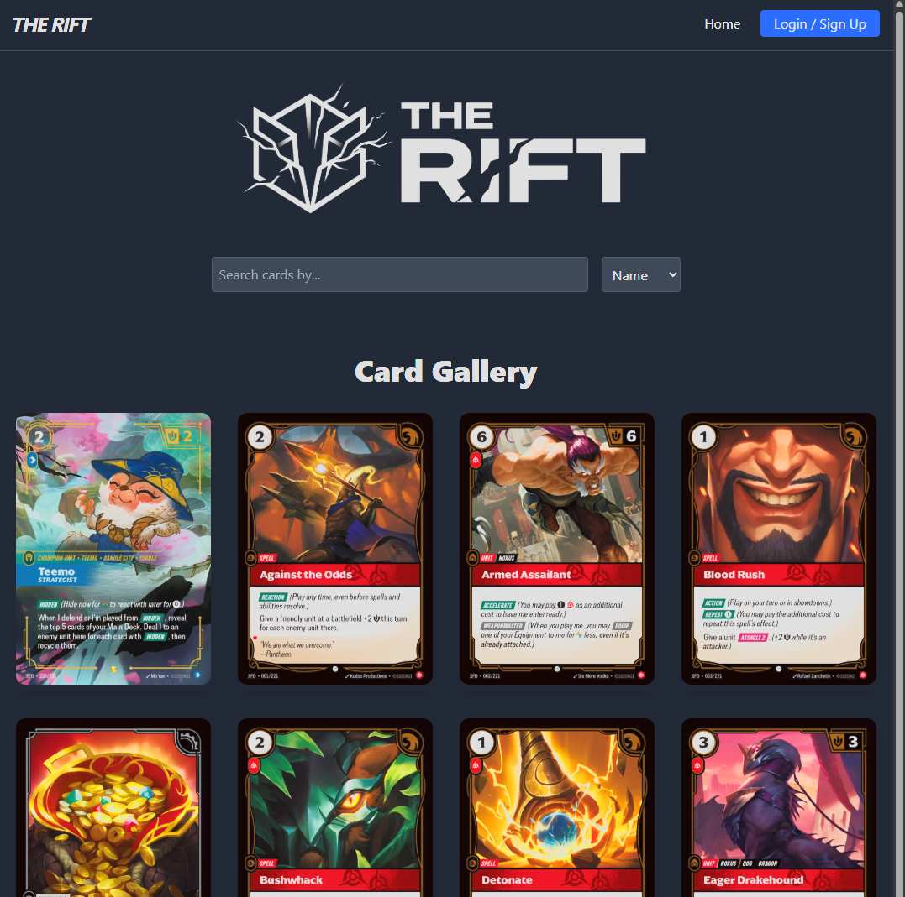
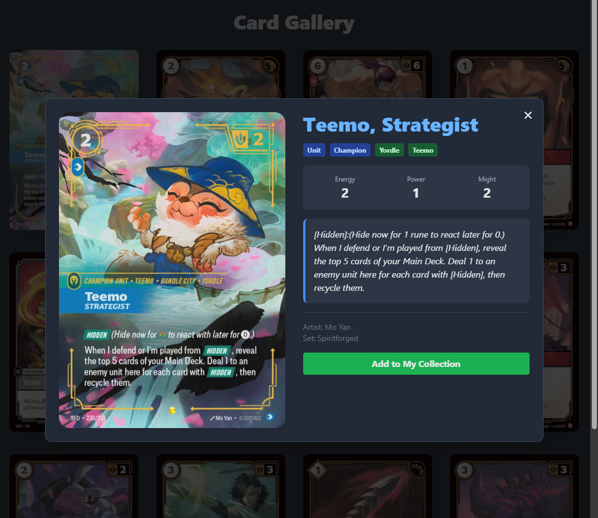
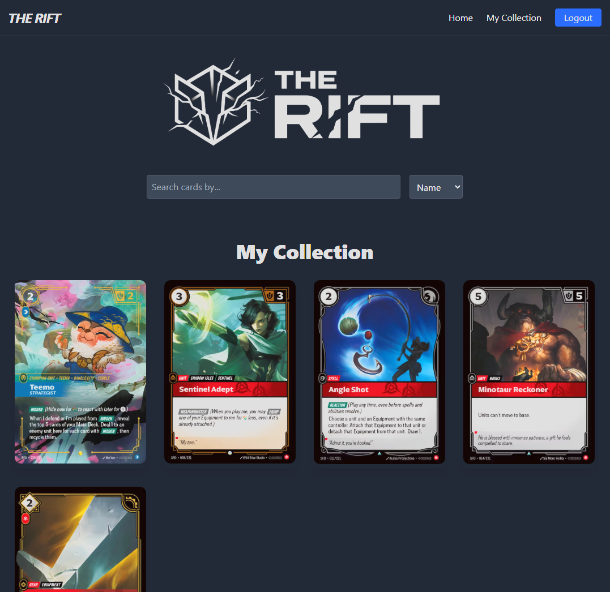

# The Rift - Digital Card Collection Manager

**The Rift** is a full-stack, secure, and responsive web application built for enthusiasts to catalog and manage their Riftbound TCG card collections.

Designed with a clean, user-centric interface and a robust backend, it demonstrates the full lifecycle of a web application, from database design to deployment.

---

## Project Information

**Developer:** Dylan Cusson  
**Course:** CSUSB Spring 2026 Platform Computing

---

## Key Features

### Secure Authentication
JWT-based user management with password hashing via bcrypt.

### Dynamic Gallery
Real-time search and filter functionality with debounced API requests to reduce server load.

### Personalized Collections
Toggle functionality to add or remove cards from a personal database, synced across the UI.

### Containerized Environment
Fully Dockerized setup ensuring the application runs consistently across different operating systems, including PC, Mac, and Linux.

---

## Tech Stack & Rationale

| Technology | Usage | Why I Chose It |
|---|---|---|
| Node.js / Express | Backend API | Lightweight, non-blocking I/O perfect for API-heavy applications. |
| MySQL | Database | ACID compliance ensures reliability for user and card data relationships. |
| Docker | Infrastructure | Removes “it works on my machine” issues by packaging the entire environment, making it easy to test and deploy across Windows, Linux, and Mac. |
| Tailwind CSS | Styling | Enables rapid development of a modern, mobile-responsive UI without custom bloat. |
| JWT | Authentication | Provides stateless session management, ideal for scalable REST APIs. |

---

## System Architecture

### Frontend
A responsive client built with Vanilla JavaScript and Tailwind CSS, utilizing `fetch` for asynchronous communication with the API.

### Backend
A RESTful API built with Node.js and Express that handles authentication middleware, database queries, and state management.

### Database
A relational schema designed with normalized tables to manage users, cards, and the many-to-many relationship between collections and cards.

---

## Disclaimer

Riftbound trademark and associated card images belong to Riot Games. This project is an educational, non-commercial application developed for coursework.
